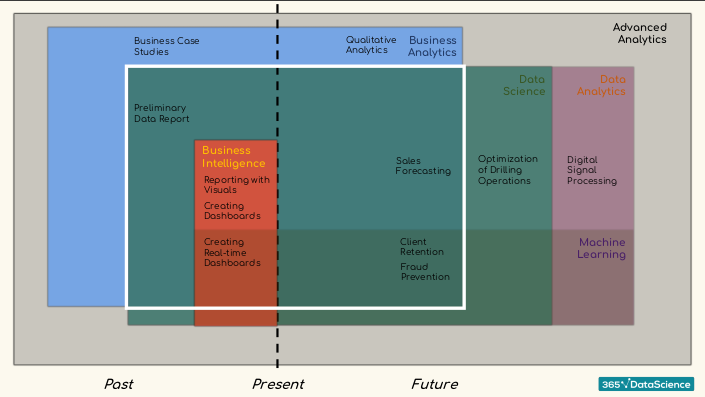

# Udemy Course

[The Data Science Course 2022: Complete Data Science Bootcamp](https://www.udemy.com/course/the-data-science-course-complete-data-science-bootcamp/?ranMID=39197&ranEAID=JVFxdTr9V80&ranSiteID=JVFxdTr9V80-AauMOFfbl5CDoSIAlLPgIA&LSNPUBID=JVFxdTr9V80&utm_source=aff-campaign&utm_medium=udemyads)
 
<small>You can buy this course on
[udemyiran](https://udemyiran.com/product-tag/%D8%AF%D8%A7%D9%86%D9%84%D9%88%D8%AF-the-data-science-course-2022-complete-data-science-bootcamp/)
</small>

[//]: # (https://udemyiran.com/checkout/order-received/123764/?key=wc_order_UW6J7rM163Dwd&wc_status=success)

## Analysis vs Analytics
_Analysis => Study of past_
 
_Analytics => Predicting Future_
 
    

## Data Science Aread

