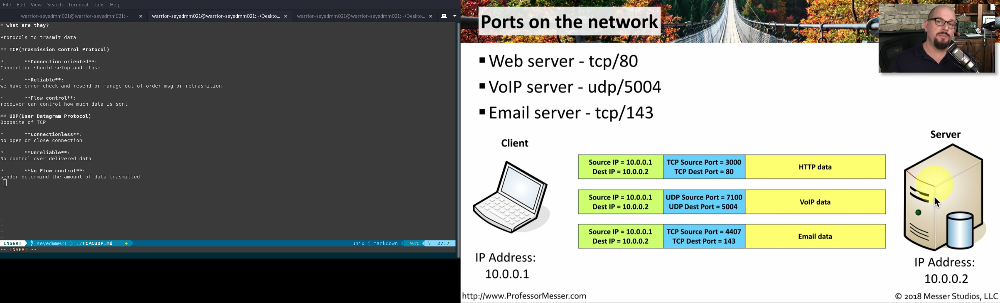

# What is PORT?

## 2 Kinds of Prts

*	**Non-ephemera Ports(-permanent port number):**

-Port 0 To 1,023

-Used on a server or service

*	**Ephemera Ports(-Temperoray ports):**

-Ports 1,024 To 65,535

-Determined in real-time by the client

## POINTS:

1.TCP&UDP ports can be between any number from 0 to 65,535

2.TCP ports aren't the same as UDP<small> we can have both UDP:80 and TCP:80</small>

## EXAMPLE:

so what will happen for First One(HTTP one?)

Client sent a HTTP request to Server

Client have a temperory PORT and server have permenent port

Both know the Destenation and Source PORT and IP

***POINT:the client port selected randomly***

