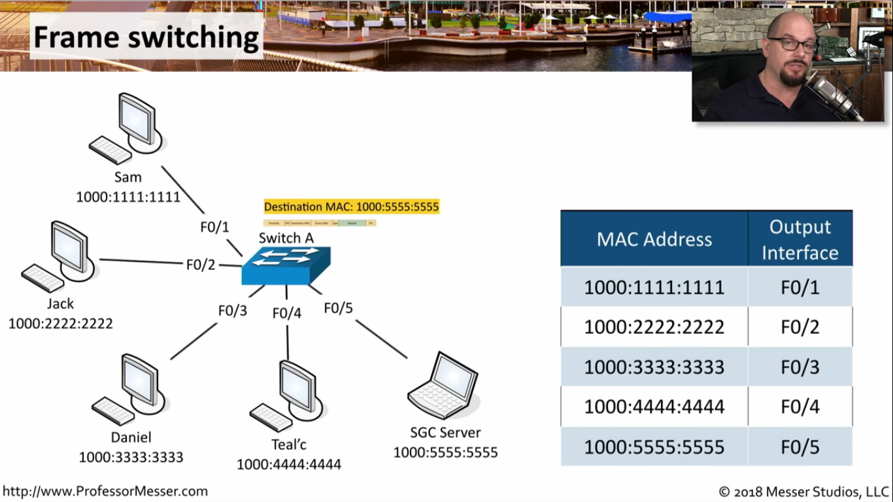

# HOW this works?

every switch as you may see have a ports

For example the Sam wants to send packet to SGC server
In the packet the destenation is set
So what will happen
when the switch get the packet? it will lock in the table and see the 1000:5550:5555
is for F0/5 so that will send the packet to the destanation

