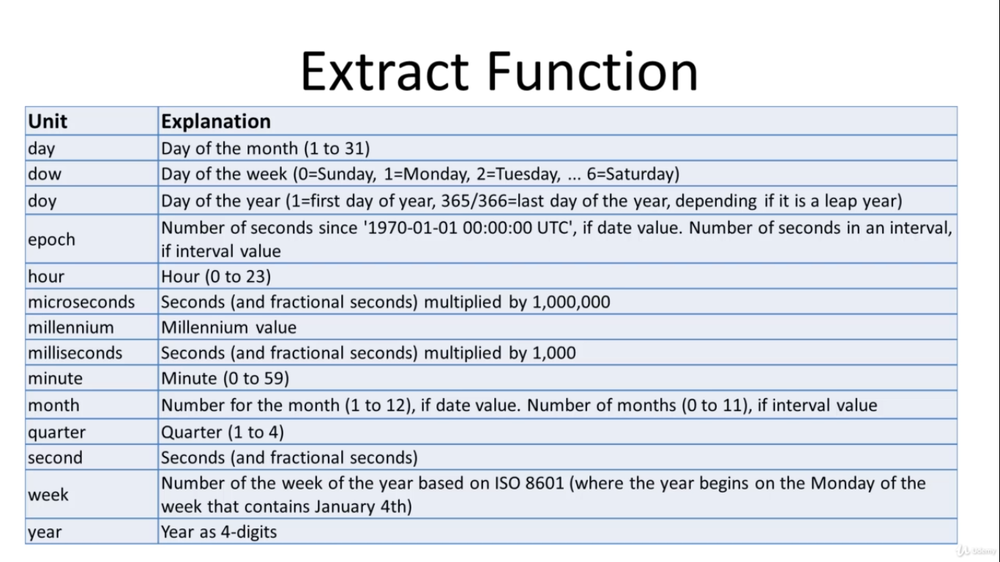

# POSTGRES datetime functions

## **refrences**

[postgres docs](https://www.postgresql.org/docs/current/functions-datetime.html#FUNCTIONS-DATETIME-TABLE)

## **more detail**

## **Example**

`SELECT id, EXTRACT(day from date_table) FROM date`
