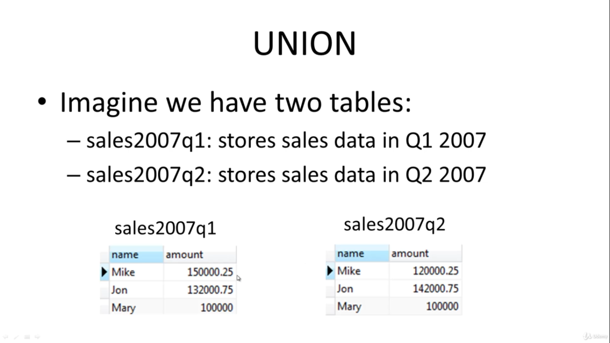
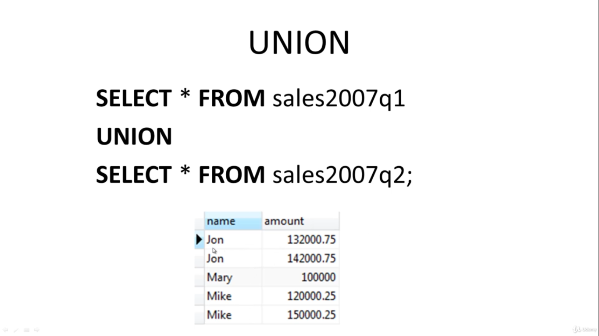

## what is UNION
UNION will combines result set or two or more `SELECT` statement

**POINT: the results of SELECT statement should be the same ot data type(or campatible data type)**

## unoin can remove duplicate datas

but if you use `UNIOIN ALL` the dublicate date will be shown

