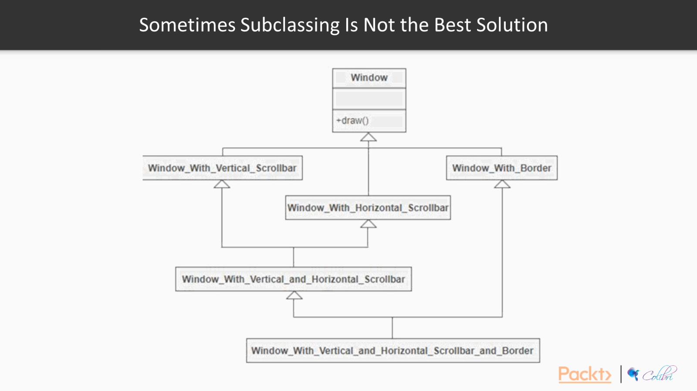
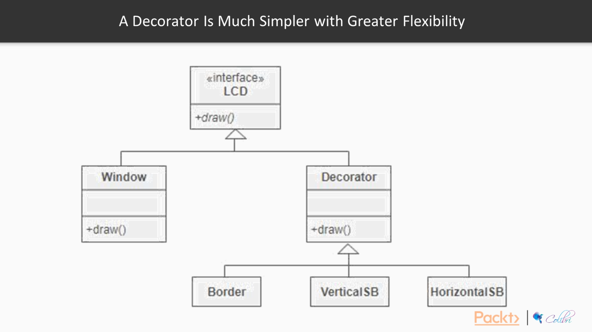

# What is Decorator Design Pattern and when to use it?

Decorator is usefull when you want to add functionality to a class or object
for example:

you have a _window_ class and you have horizental, vertical and border scrolling what will  you do if you want
to have a window with both vertical and horizental scrolling?
a class which inherit both vertical and horizental scrolling?
what is you want to have booth border an horizental scrolling?

 

what is this scalle large and we have many inheritance cases?

**So we should have a better aproch**

we can use ***Decorator Design Pattern*** 
this pattern say we can have seprate class (acctually in this case) for every scroll
and we can then join this in calling

for better understading you can take a look at [`windowsEg.py`](./windowsEg.ipynb)

### Resources
[faif design patterns](https://github.com/faif/python-patterns/blob/master/patterns/structural/decorator.py)